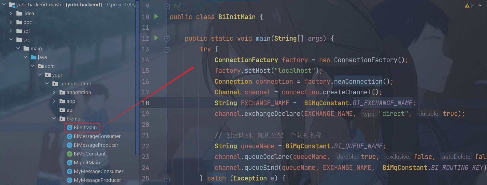

# 智能BI项目[SpringBoot + RabbitMQ + AIGC + (React) 实现报表可视化]


## 一、项目介绍

### 1. 对比传统BI

传统 BI 平台需要按照以下步骤

1. 手动上传数据
2. 手动选择分析所需的数据行和列（由数据分析师完成）
3. 需要手动选择所需的图表类型（由数据分析师完成）
4. 生成图表并保存配置


智能 BI 平台

> 与传统的 BI 不同，我们的解决方案允许用户（数据分析者）仅需导入最最最原始的数据集并输入分析目标（例如网站增长趋势），即可利用 AI 自动生成符合要求的图表和结论，从而显著提升分析效率。

优点：让不会数据分析的人也能通过输入目标快速完成数据分析，大幅节约人力成本。


## 二、架构图


## 三、技术栈

前端：

1. React
2. 开发框架 Umi + Ant Design Pro
3. 可视化开发库(Echarts + HighCharts + AntV)
4. umi openapi 代码生成(自动生成后端调用代码)


后端：

1. Spring Boot (万用 Java 后端项目模板，快速搭建基础框架，避免重复写代码)
2. MySQL数据库
3. MyBatis Plus数据访问框架
4. 消息队列(RabbitMQ)
5. AI 能力(DeepSeek接口)
6. Excel 的上传和数据的解析(Easy Excel)
7. Swagger + Knife4j 项目接口文档
8. Hutool 工具库


## 四、快速上手

### 1. 前端

- node -v 18.20.8

执行

```
npm install --forec
```


运行

```
npm run start:dev
```


### 2. 后端

#### 2.1 MySQL

1）修改 `application.yml` 的数据库配置为你自己的：

```yml
spring:
  datasource:
    driver-class-name: com.mysql.cj.jdbc.Driver
    url: jdbc:mysql://localhost:3306/my_db
    username: root
    password: 123456
```

2）执行 `sql/create_table.sql` 中的数据库语句，自动创建库表


#### 2.2 Redis

1）修改 `application.yml` 的 Redis 配置为你自己的：

```yml
spring:
  redis:
    database: 1
    host: localhost
    port: 6379
    timeout: 5000
    password: 123456
```


#### 2.3 RabbitMQ




执行完这两‌个 初始化的 Ma⁡in 方法之后，打‍开浏览器


#### 2.4 启动项目

访问接口文档：http://localhost:8080/api/doc.html

可以自己在里面设置账号和密码


